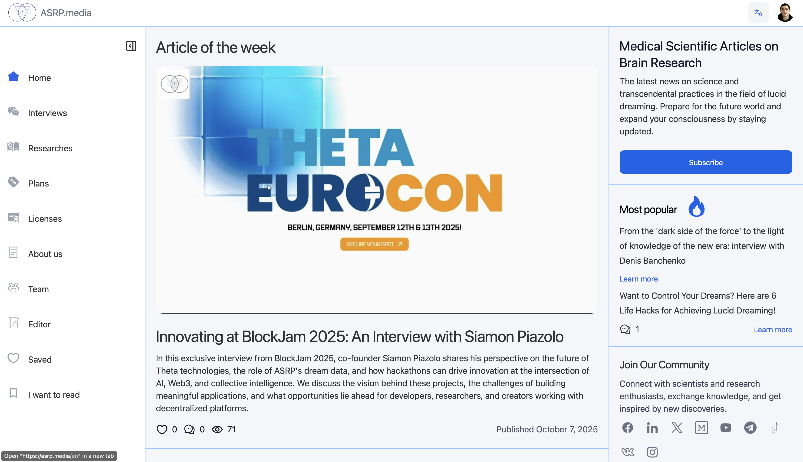

# Hi there, I'm Mykhailo Kapustin 👋

I am a **Chief Technology Officer** and **Software Architect** with a passion for cutting-edge technology and consciousness research. My work spans across artificial intelligence, blockchain technology, and the fascinating intersection of technology with human consciousness through lucid dreaming studies.

🛠️ Tech Stack

***

🏢 Professional Experience

### **Co-Founder & CTO** at Advanced Scientific Research Projects (ASRP.media)
*April 2023 – Present · 2 yrs 7 mos*

**Key Achievements Over 18 Months:**
- 🧠 **Kapustin's Marker Algorithm**: Innovative algorithm for analyzing dream content
- 🎓 **Educational Platform**: Multifunctional platform with diverse courses and programs
- 🌐 **ASRP.tech Website**: Official website with ecosystem product links
- 🤖 **Arcanum12thBot**: Telegram bot for dream journal and educational platform access
- 📱 **Telegram Mini Application**: Lightweight app for quick service access
- 📝 **Dream Journal**: Tool for recording and analyzing dreams
- ⚙️ **Microservices Infrastructure**: Event handling, mailing, queues, SMS systems
- 📰 **ASRP.media**: Information platform for dream research and consciousness studies
- 🔬 **ASRP.science**: Platform for publishing and sharing research findings
- 💰 **Kapusta Cryptocurrency**: Internal ecosystem cryptocurrency

**Additional Responsibilities:**
- Research processing and client acquisition
- Organizing conferences with scientists
- Recruiting and mentoring junior developers
- Project management and investor negotiations
- Partner integrations and payment system setups

### **Senior AI/ML Engineer** at Woolf
*April 2025 – September 2025 · 6 mos (Contract)*

- 🤖 Designed and implemented MVP LLM-agent prototype using Google ADK
- 🏗️ Acted as lead architect for educational assessment AI applications
- 📊 Delivered insights on LLM agent capabilities and limitations in EdTech
- 📚 Contributed to knowledge transfer and partner enablement

### **Senior Back-end Developer** at LAB325 - Product Engineering
*July 2021 – April 2023 · 1 yr 10 mos*

- ⚡ Engineered robust backend solutions with enhanced performance and scalability
- 🔧 Developed high-performance systems using modern technologies

### **Team Lead & Senior Back-end Developer** at MOB.325
*July 2021 – April 2023 · 1 yr 10 mos*

- 👥 Led development teams and managed complex projects
- 🚀 Delivered scalable backend solutions

### **Senior Back-end Developer** at Provectus
*April 2021 – July 2021 · 4 mos*

- 🔧 Developed backend solutions using PHP and Laravel
- ⚡ Enhanced system performance and scalability

### **Team Lead & Senior Back-end Developer** at Coelix
*August 2020 – April 2021 · 9 mos*

- 🏢 Transitioned company from WordPress-focused to full-scale custom software solutions
- 👥 Assembled and led development team for complex projects
- 🎯 Successfully delivered three major client projects
- 📈 Expanded company's service offerings and client base

### **Web Full Stack Developer** at Ephyros
*February 2020 – July 2020 · 6 mos*

- 🌐 Developed full-stack web applications using PHP and Laravel
- 🔧 Built scalable and maintainable solutions

### **Web Full Stack Developer** at HYS Enterprise
*September 2018 – February 2020 · 1 yr 6 mos*

- 🏢 Key developer for corporate website
- 🔧 Maintained and enhanced web applications
- 📈 Contributed to company's digital presence

### **Web Full Stack Developer** at Top Agent
*January 2018 – September 2018 · 9 mos*

- ✈️ Developed comprehensive travel management platform
- 🎯 Integrated flight booking, taxi services, hotel reservations
- 💰 Implemented cost analysis and payment systems
- 📊 Created reporting and ticketing systems

### **Web Full Stack Developer** at PHP-academy
*July 2017 – December 2017 · 6 mos*

- 🏗️ Developed robust website engine from scratch
- 🌐 Created websites and provided ongoing support
- 🔧 Ensured optimal performance and security

### **Back-end Developer & Manager Account** at SuperMediaAds
*June 2016 – November 2016 · 6 mos*

- 📱 Managed mobile account operations
- 🤝 Identified partners and promotion opportunities
- 🔗 Integrated partner APIs using PHP
- 💼 Balanced technical development with business partnerships

***

📚 Education

### Master's Degree in Automation and Computer-Integrated Technologies
*State University of Intelligent Technologies and Telecommunications (2017 – 2022)*

<b>🎓 View Diploma & Academic Records</b>

**Degree Details:**
- **Program:** Automation and Computer-Integrated Technologies
- **Institution:** State University of Intelligent Technologies and Telecommunications
- **Duration:** 2017 – 2022
- **Level:** Master's Degree

**Academic Documentation:**
- 📄 **[Diploma & Academic Records](education/telecommunication/telecomunication-education.pdf)** - Complete diploma with grades and academic achievements

*Click to view full diploma document with grades and academic details*

***

📖 Publications & Articles

### 📝 **Technical Articles (2023-2025)**

**["Building an App Store Review Analysis Pipeline with Python NLP & Data Visualization"](https://kapustinomm.hashnode.dev/building-an-app-store-review-analysis-pipeline-with-python-nlp-and-data-visualization)** *(October 2025)*
- Published on: [Hashnode](https://kapustinomm.hashnode.dev/building-an-app-store-review-analysis-pipeline-with-python-nlp-and-data-visualization) | [Medium](https://medium.com/@kapustinomm/from-star-ratings-to-insights-building-an-app-store-review-analysis-pipeline-with-python-nlp-56002731e661)
- An analytical case study on how App Store reviews can be transformed into structured insights using Python, NLP, and data visualization. The article explores how user feedback reflects social sentiment and how such data can help forecast trends within digital ecosystems

**["Google ADK and 'Startup Technical Guide: AI Agents': how Google is redefining the way AI agents are built"](https://habr.com/en/articles/953592/)** *(October 2025)*
- Published on: [Habr](https://habr.com/en/articles/953592/) | [Hashnode](https://kapustinomm.hashnode.dev/google-adk-and-startup-technical-guide-ai-agents-how-google-is-redefining-the-way-ai-agents-are-built) | [Medium](https://medium.com/@kapustinomm/google-adk-and-startup-technical-guide-ai-agents-how-google-is-redefining-the-way-ai-agents-are-a0bbceede6bf)
- Google has released a 64-page Startup Technical Guide: AI Agents — a document that can rightfully be called a roadmap for building agentic systems. I read it cover to cover and pulled out five key ideas: from architecture built on Google ADK to the principles of AgentOps and grounding. This isn't about "chatbots" anymore — it's about a new generation of engineering platforms

**["My First AI & Blockchain Hackathon: Building the Global Forecasting System at Theta EuroCon in Berlin"](https://kapustinomm.hashnode.dev/my-first-ai-and-blockchain-hackathon-building-the-global-forecasting-system-at-theta-eurocon-in-berlin)** *(September 2025)*
- Published on: [Hashnode](https://kapustinomm.hashnode.dev/my-first-ai-and-blockchain-hackathon-building-the-global-forecasting-system-at-theta-eurocon-in-berlin) | [Habr](https://habr.com/en/articles/947040/) | [Medium](https://medium.com/@kapustinomm/my-first-ai-blockchain-hackathon-building-the-global-forecasting-system-at-theta-eurocon-in-aab842d63625)
- In September 2025, I joined my first hackathon — Theta EuroCon Hackathon in Berlin. Together with my team at ASRP, we built the first prototype of the Global Forecasting System (GFS), a bold attempt to create the first real competitor to BlackRock's Aladdin. In this article, I share what we built in just five days, how the hackathon atmosphere pushed us beyond our limits, and why GFS has the potential to change the way we forecast social, geopolitical, and economic events

**["Building a Resume Matcher with tRPC, NLP, and Vertex AI"](https://kapustinomm.hashnode.dev/building-a-resume-matcher-with-trpc-nlp-and-vertex-ai)** *(September 2025)*
- Published on: [Hashnode](https://kapustinomm.hashnode.dev/building-a-resume-matcher-with-trpc-nlp-and-vertex-ai) | [Medium](https://medium.com/@kapustinomm/building-a-resume-matcher-with-trpc-nlp-and-vertex-ai-fec6e9896adb) | [Habr](https://habr.com/en/articles/943306/)
- In this article, I share how I built a resume matcher app using tRPC, TypeScript, and Google Vertex AI. The project takes PDF resumes and job postings, extracts text, applies basic NLP for skill detection, and then calls Gemini 1.5 Flash for deeper analysis. Along the way, I explain why tRPC felt faster and cleaner than REST or GraphQL for an MVP, show code snippets from the repo, and discuss both the benefits and trade-offs of this approach

**["My Personal Exam: How I Built an MVP LLM Agent on Google ADK"](https://kapustinomm.hashnode.dev/my-personal-exam-how-i-built-an-mvp-llm-agent-on-google-adk)** *(September 2025)*
- Published on: [Hashnode](https://kapustinomm.hashnode.dev/my-personal-exam-how-i-built-an-mvp-llm-agent-on-google-adk) | [Habr](https://habr.com/en/articles/942696/) | [Medium](https://medium.com/@kapustinomm/my-personal-exam-how-i-built-an-mvp-llm-agent-on-google-adk-90c246ab9c2a)
- In this article, I share my personal experience of developing an MVP LLM agent with Google ADK in educational scenarios. I describe how I built the architecture from a monolithic agent to a modular system, the challenges I faced (memory, tokens, orchestration), and the engineering hacks that helped me overcome them. Most importantly, I share the philosophy: why working with LLMs feels like taking an exam, how the role of a CTO evolves, and what such projects can teach us. In the end, I summarize with 10 lessons I learned from this "AI exam"

**["Docling in Working with Texts, Languages, and Knowledge"](https://kapustinomm.hashnode.dev/docling-in-working-with-texts-languages-and-knowledge)** *(August 2025)*
- Published on: [Hashnode](https://kapustinomm.hashnode.dev/docling-in-working-with-texts-languages-and-knowledge) | [Medium](https://medium.com/@kapustinomm/docling-in-working-with-texts-languages-and-knowledge-87263c51dfeb) | [Habr](https://habr.com/en/articles/935584/)
- A professional overview of Docling as an environment for working with linguistic and textual data, presented through the lens of digital humanities and AI research. This comprehensive analysis explores how Docling transforms academic documents into structured, graph-based knowledge representations, enabling better peer review, semantic analysis, and integration with LLM pipelines

**["How to Integrate Google ADK with a Custom Interface"](https://medium.com/@kapustinomm/how-to-integrate-google-adk-with-a-custom-interface-a-step-by-step-guide-with-examples-04f01ab501ca)** *(July-August 2025)*
- Published on: [Medium](https://medium.com/@kapustinomm/how-to-integrate-google-adk-with-a-custom-interface-a-step-by-step-guide-with-examples-04f01ab501ca) | [Hashnode](https://kapustinomm.hashnode.dev/how-to-integrate-google-adk-with-a-custom-interface-a-step-by-step-guide-with-examples) | [Habr](https://habr.com/en/articles/933804/)
- A comprehensive guide to integrating Google ADK into custom interfaces: code examples, session management, FastAPI integration, deployment on Vertex AI, and agent architecture. This step-by-step tutorial covers everything from basic agent creation to production-ready implementations with custom backends and state management

### 🔬 **Research Publications (2024-2025)**

**["Technological Transformations, Formation of GMS (Global Mental System) and GFS (Global Forecasting System) —'Right-Brain Technologies' Based on Biological Entities with Consciousness, Artificial Intelligence, Quantum Computing, and Blockchain"](https://www.researchgate.net/publication/388438082_Technological_Transformations_Formation_of_GMS_Global_Mental_System_and_GFS_Global_Forecasting_System_-Right-Brain_Technologies_Based_on_Biological_Entities_with_Consciousness_Artificial_Intelligence_)** *(February 2025)*
- *Journal of Investment, Banking and Finance*
- This study explores methodological approaches to transmitting consciousness states between subjects using advanced neurointerface technologies. It discusses the formation of the Global Mental System (GMS) and Global Forecasting System (GFS), focusing on "right-brain technologies" that integrate biological entities with consciousness and artificial intelligence. The research examines the application of AI algorithms for processing and transmitting data, enabling the classification and analysis of neural information

**["The methodology for diagnosing and managing stress developed by Grivtsova, as an independent method and as part of the preparation for inducing lucid dreams within the framework of the 'Bancheko Extended Algorithm,' and its application in the 'GFS'"](https://www.researchgate.net/publication/383412731_The_methodology_for_diagnosing_and_managing_stress_developed_by_Grivtsova_as_an_independent_method_and_as_part_of_the_preparation_for_inducing_lucid_dreams_within_the_framework_of_the_Bancheko_Extende)** *(July 2024)*
- *American Journal of Medical and Clinical Research & Reviews*
- The study explores Grivtsova's stress management methodology both as a standalone approach and as part of Banchenko Extended, a framework for lucid dream induction. The research analyzes its efficacy in stress reduction and dream-state control enhancement

**["Forecasting Social, Geopolitical, and Economic Events Using the 'Banchenko-Technology'"](https://www.researchgate.net/publication/381995064_Forecasting_Social_Geopolitical_and_Economic_Events_Using_the_%27Banchenko-Technology%27)** *(June 2024)*
- *Japan Journal of Research*
- This study investigates the Banchenko Algorithm and Mnemonic Synchronization for predicting social, geopolitical, and economic events. It examines the link between lucid dreaming and collective consciousness for forecasting significant events. The research introduces a digital system for managing event forecasts and market trends using AI and dream synchronization techniques, highlighting the innovative potential of combining dream experiences with objective data for high-probability predictions

**["Application of 'Banchenko's Mnemonic Dream Synchronization Method' for Joint Lucid Dream Synchronization within 'Blokhin's Dreaming Cell Concept,' Analyzed Using 'Kapustin's AI Dream Matching Model'"](https://www.researchgate.net/publication/378492219_The_Application_of_the_Banchenko%27s_Mnemonic_Dream_Synchronization_Method_for_the_Joint_Synchronization_of_Dream_Elements_Including_Lucid_Dreams_within_the_Framework_of_Blokhin%27s_Dreaming_Cell_Concept_)** *(January 2024)*
- *International Internal Medicine Journal*
- This research investigates the use of Banchenko's Mnemonic Dream Synchronization Method for synchronizing dream elements, including lucid dreams, among participants. It involves analyzing dream journals, utilizing AI for dream correlation, and studying the impact of synchronized activities on dream content. The study highlights the potential of using synchronized dream techniques to enhance dream recall and explore the subconscious

### 📊 **Academic Research (2018)**

**["A STUDY OF SOFTWARE DEVELOPMENT TOOLS THAT ARE REQUIRED IN THE JOB MARKET IN UKRAINE AND THE WORLD"](https://www.researchgate.net/publication/331283099_A_STUDY_OF_SOFTWARE_DEVELOPMENT_TOOLS_THAT_ARE_REQUIRED_IN_THE_JOB_MARKET_IN_UKRAINE_AND_THE_WORLD)** *(December 2018)*
- *Proceedings of the O S Popov ОNAT*
- This research investigates software development tools needed in the job market. It analyzes global and Ukrainian IT trends, focusing on programming languages and frameworks like JavaScript, Python, and AngularJS. The study highlights differences in tool popularity between Ukraine and other countries, providing insights into current and future IT industry demands, and showcasing my involvement in cutting-edge software development research

### 🌐 **Popular Science & Technology Articles**

**["Lucid dreams and VR: Swiss Olympic team training in dreams"](https://tproger.ru/articles/vr-i-osoznannye-sny--trenirovki-olimpijcev-vo-sne)** *(December 2024)*
- *Tproger* - How VR and conscious dreams are already helping the Swiss Olympic team train in their sleep. Find out how technology is changing sports, training and programming by blurring the boundaries between reality and dreams

**["Brain–computer interface (BCI) in HR: How Technology is Changing Recruitment"](https://tproger.ru/articles/nejroseti-v-hr--budushhee-podbora-personala-cherez-sinhronizaciyu-sostoyanij)** *(December 2024)*
- *Tproger* - Learn how neural interfaces and neural networks are turning the hiring process into an exact science. Cognitive synchronization and brain signal analysis technologies help build harmonious teams and automate recruitment

**["From Pet Project to Scientific Research: Path to True Innovation"](https://tproger.ru/articles/ot-pet-proekta-do-nauchnogo-issledovaniya-put-k-nastoyashhej-innovacii)** *(October 2024)*
- *Tproger* - The article explores how vivid dreams can inspire programmers, enhancing their creativity and problem-solving abilities. It discusses the significance of sleep in forming creative neural connections and how programmers often experience lucid dreaming. The article highlights the importance of balancing work and sleep to maintain productivity and innovation. By understanding the role of sleep, programmers can leverage their dreams to generate new ideas and solutions

**["The Economics of Dreams: How Our Dreams Influence Global Markets"](https://samara.aif.ru/society/ekonomika-snovideniy-kak-nashi-sny-vliyayut-na-mirovye-rynki)** *(May 2024)*
- *Аргументы и факты* - The article explores how the study of lucid dreaming and dream synchronization can impact global markets. Researchers, led by Denis Banchenko, have identified a new economic sector— the "dream market." This involves the influence of dreams on consumer behavior and market trends, supported by AI and blockchain technologies. The findings suggest that dreams and subconscious states can significantly affect economic activities and investment strategies

**["From Pet Project to Scientific Research: Path to True Innovation"](https://tproger.ru/articles/ot-pet-proekta-do-nauchnogo-issledovaniya-put-k-nastoyashhej-innovacii)** *(October 2023)*
- *Tproger* - The article explores how passion projects in programming can evolve into significant scientific research. It highlights a case where a simple pet project on dream synchronization led to groundbreaking results. Utilizing AI and innovative models, researchers achieved notable insights into dream analysis and synchronization, demonstrating the potential of combining creativity with scientific inquiry

**["Future Technologies: A Glimpse into Innovation"](https://tproger.ru/articles/tehnologii-budushhego-vzglyad-v-mir-innovacij)** *(October 2023)*
- *Tproger* - The article discusses four future technologies set to transform our world: Artificial Intelligence, Quantum Computing, Quantum Communications, and Neurointerfaces. It highlights AI's automation and diagnostic potential, quantum computing's data processing power, quantum communications' secure data transmission, and neurointerfaces' direct brain-device interaction. These innovations promise to revolutionize various aspects of life and technology

**["AI and Lucid Dreaming: Exploring New Opportunities"](https://tproger.ru/articles/otkrojte-dver-v-mir-snovidenij-iskusstvennyj-intellekt-osoznannye-snovideniya-i-novyj-rynok-vozmozhnostej)** *(June 2023)*
- *Tproger* - The article delves into how artificial intelligence aids in studying lucid dreams. It presents a model developed by ASRP, which uses AI to analyze and understand dreams deeply. The technology, built on microservice architecture and leveraging tools like Pinecone and Elasticsearch, offers practical applications in therapy and creativity. It opens new avenues for exploring the subconscious mind and utilizing dreams for emotional and creative insights

***

🎤 Conferences & Speaking

### WeAreDevelopers World Congress Europe

July 2024, Berlin, Germany

<table align="center">
  <tr>
    <td align="center">
      
    </td>
    <td align="center">
      
    </td>
    <td align="center">
      
    </td>
    <td align="center">
      
    </td>
  </tr>
  <tr>
    <td align="center">
      
    </td>
    <td align="center">
      
    </td>
    <td align="center">
      
    </td>
    <td align="center">
      
    </td>
  </tr>
  <tr>
    <td align="center">
      
    </td>
    <td align="center">
      
    </td>
    <td align="center">
      
    </td>
    <td align="center">
    </td>
  </tr>
</table>

<b>🔍 View Conference Details</b>

**Event Details:**
- **Focus Areas:** Software Development, Technology Innovation, Developer Community
- **Location:** WeAreDevelopers World Congress Europe
- **Participation:** Conference attendance and networking

**My Experience:**
- 🎯 **Technology Insights:** Gained valuable insights into latest development trends
- 🏆 **Networking:** Connected with developers and industry professionals
- 🤝 **Knowledge Sharing:** Participated in technical discussions and workshops

*Click on any photo above to view full size*

---

###  THETA EuroCon European Theta Network Conference & Hackathon

September 2025, Berlin, Germany

<table align="center">
  <tr>
    <td align="center">
      
    </td>
    <td align="center">
      
    </td>
    <td align="center">
      
    </td>
  </tr>
</table>

<b>🔍 View Conference Details</b>

**Event Details:**
- **Focus Areas:** Blockchain, Hackathon, AI, LLM, Cloud Infrastructure
- **Location:** European Theta Network Conference
- **Participation:** Live pitch presentation and hackathon participation

**My Contribution:**
- 🎯 **Live Pitch Presentation:** Delivered a compelling presentation on my project
- 🏆 **Hackathon Participation:** Built innovative solutions combining AI and blockchain technologies
- 🤝 **Networking:** Connected with industry leaders and fellow innovators

**Related Content:**
- 📝 **Article:** ["My First AI & Blockchain Hackathon: Building the Global Forecasting System"](https://medium.com/@kapustinomm/my-first-ai-blockchain-hackathon-building-the-global-forecasting-system-at-theta-eurocon-in-aab842d63625)
- 🎥 **Live Pitch Video:** [YouTube Presentation](https://www.youtube.com/watch?v=8ubUtSxpi-g)

*Click on any photo above to view full size*

***

💼 Projects

<b>🏢 HYS Enterprise – Corporate Website</b> <em>(September 2018 – February 2020)</em>

**Project Overview:**
The HYS Enterprise corporate website serves as the official digital portal for one of Ukraine's largest IT companies. It provides a comprehensive overview of the company's expertise, services, and values, acting as a primary point of contact for clients, partners, and potential employees.

**Live Website:** [https://www.hys-enterprise.com](https://www.hys-enterprise.com)

  

**Key Features:**
- **Company Presentation** – Showcasing HYS Enterprise's mission, services, and expertise in software development
- **Portfolio** – Highlighting completed projects in software development, business process automation, and IT consulting
- **Careers Section** – Listing job opportunities, work culture, and hiring process details
- **Contact Information** – Providing direct ways to reach company representatives

**My Role and Contributions:**
As a Full-Stack Web Developer, I was the key developer responsible for designing, developing, and maintaining the corporate website:
- Developing and implementing frontend and backend features for the site
- Ensuring responsive design and seamless user experience across devices
- Optimizing performance and security to maintain a high standard of quality
- Collaborating with designers, marketers, and stakeholders to align the website with company branding and business goals
- Performing regular maintenance, updates, and debugging to ensure smooth functionality

**Technologies Used:**
- WordPress
- React.js
- PostgreSQL

---

<b>🌱 QPQ International – Green Energy Project Funding & Advisory Platform</b> <em>(February 2020 – July 2020)</em>

**Project Overview:**
QPQ International is a digitally-enabled bespoke deal advisory platform dedicated to advancing green energy projects globally. The company focuses on assisting project developers in accelerating development, securing financing, and establishing partnerships to promote sustainable initiatives.

**Live Website:** [https://qpq.international](https://qpq.international)

  

**Key Services:**
- **Project Development Support** – QPQ International collaborates with developers to enhance project readiness, ensuring all necessary components are in place to attract investors
- **Investor Matching** – Leveraging a vast network of over 600 professional investors, including private equity funds, institutional investors, and independent power producers (IPPs), QPQ connects suitable investors with vetted projects
- **Funding Accelerator Program** – The Green Energy Project Funding Accelerator is an initiative designed to bridge the gap between green energy projects and investors. It offers coaching and training to project sponsors, culminating in events that showcase vetted projects to potential investors

**Mission:**
QPQ International is committed to making the planet greener by supporting project developers and business owners in the sustainability and renewable energy sectors. The company aims to accelerate the achievement of the United Nations' Sustainable Development Goals (SDGs) through its initiatives.

**Global Reach:**
Based in Dubai, QPQ International operates worldwide, focusing on markets including the US, Canada, Europe, the Balkans, the Baltics, select South American countries, Southeast Asia, Australia, and New Zealand.

**Technologies Used:**
- Laravel
- Vue.js
- PostgreSQL
- Nginx

---

<b>📚 Your Torah Tutors – Online Torah Learning Platform</b> <em>(August 2020 – April 2021)</em>

**Project Overview:**
Your Torah Tutors is an online educational platform dedicated to empowering students to become independent and confident learners in Torah study. The platform offers personalized tutoring sessions focusing on enhancing vocabulary, grammar, and comprehension skills in both Chumash and Gemara. Utilizing unique flashcards and engaging teaching methods, the program makes learning enjoyable and effective. Lessons are conducted via Zoom, making them accessible to students aged 8 and up, regardless of their location.

**Live Website:** [https://yourtorahtutors.org](https://yourtorahtutors.org)

  

**Key Features:**
- **Personalized Learning** – Tailored sessions that cater to the individual needs of each student, ensuring effective learning outcomes
- **Innovative Teaching Tools** – Use of unique flashcards and interactive methods to expand vocabulary and enhance understanding
- **Qualified Tutors** – A team of carefully selected tutors who excel in teaching techniques and are sensitive to each child's needs
- **Flexible Access** – Online lessons via Zoom, allowing students from various locations to participate

**My Role and Contributions:**
As a developer for Your Torah Tutors, my responsibilities included:
- **Website Development** – Designed and developed the official website, ensuring a user-friendly interface and seamless navigation
- **Platform Integration** – Implemented Zoom integration for online lessons, providing a stable and accessible virtual learning environment
- **Flashcard System** – Developed the unique flashcard feature to aid in vocabulary expansion and retention
- **User Accounts** – Created secure login portals for teachers and students, facilitating personalized learning experiences
- **Feedback Mechanism** – Integrated a system for collecting and displaying testimonials to showcase the program's effectiveness

**Technologies Used:**
- Laravel
- Vue.js
- PostgreSQL
- Docker
- PHP
- Nginx

---

<b>🌱 Lill – Intelligent Plant Care Assistant</b> <em>(July 2021 – October 2021)</em>

**Project Overview:**
Lill is a mobile application designed to assist plant enthusiasts in identifying, diagnosing, and caring for their plants. The app offers a comprehensive suite of features to ensure optimal plant health and growth.

  
  
  
  

**Key Features:**
- **Plant Identification and Diagnosis** – Instantly identify various plant species and diagnose potential issues, providing users with tailored treatment suggestions
- **Smart Care Reminders** – Set up customizable notifications for essential plant care tasks, including watering, fertilizing, spraying, cleaning, and repotting, ensuring timely maintenance
- **Personalized Garden Management** – Create and manage personal plant collections within the app. Track growth, monitor health, and organize plants by different locations or categories using the "My Garden" and "My Places" features

**My Role and Contributions:**
As a developer for Lill, my responsibilities included:
- **Mobile Application Development** – Led the development of the iOS and Android applications, ensuring a seamless and intuitive user experience across platforms
- **Plant Identification Integration** – Implemented advanced algorithms and machine learning models to accurately identify plant species and diagnose potential issues
- **Notification System** – Developed a robust notification system to provide users with timely reminders for various plant care activities
- **User Interface Design** – Collaborated with designers to create an intuitive and visually appealing interface, enhancing user engagement and satisfaction
- **Data Management** – Ensured secure and efficient handling of user data, including personal plant collections and care schedules

**Technologies Used:**
- Node.js
- PostgreSQL
- GraphQL
- Docker
- Nginx

---

<b>💪 IzziFit – Smart Workout and Training Plan Application</b> <em>(October 2021 – January 2022)</em>

**Project Overview:**
IzziFit is a mobile application designed to provide users with personalized workout routines and comprehensive fitness tracking tools. The app offers over 500 exercises tailored to individual needs, making it suitable for both beginners and fitness enthusiasts.

  
  
  
  

**Key Features:**
- **Personalized Workouts** – Access a vast library of exercises selected to match your fitness level and goals
- **Calorie Calculator** – Easily log your meals, and the app calculates your daily caloric intake to help you stay on track
- **Gamified Experience** – Turn your fitness journey into an engaging game by converting burned calories into energy, which can be used to earn rewards within the app
- **Additional Tools** – Utilize features like a mood tracker, water intake reminders, meal planning, and smart workout suggestions to support a holistic approach to health

**My Role and Contributions:**
As a developer for IzziFit, my responsibilities included:
- **Mobile Application Development** – Led the development of the iOS and Android applications, ensuring a seamless user experience across platforms
- **Backend Integration** – Implemented robust backend services to handle user data securely and efficiently
- **Gamification Features** – Developed the gamification elements that allow users to earn rewards based on their workout performance, enhancing user engagement
- **Performance Optimization** – Conducted thorough testing and optimization to ensure the app runs smoothly on various devices

**Technologies Used:**
- Node.js
- GraphQL
- Docker
- Nginx
- PostgreSQL
- ClickHouse

---

<b>💬 Hark – Global Anonymous Chat Platform</b> <em>(January 2022 – March 2022)</em>

**Project Overview:**
Hark is a mobile application designed to facilitate anonymous conversations between individuals worldwide. The platform provides a safe space for users to share their thoughts, discuss personal or professional challenges, and connect with others without revealing their identities.

  
  
  
  

**Key Features:**
- **Anonymous Communication** – Users can engage in voice or text chats without disclosing personal information, ensuring privacy and fostering open dialogue
- **Emotional Expression** – The app offers various modes for users to express their emotions, allowing for genuine and heartfelt interactions
- **Safe Environment** – Hark provides a secure space for users to vent about work or personal life, ensuring that conversations remain confidential and respectful
- **Favorites and Soul Mates** – Users can reconnect with individuals who have positively impacted them by adding them to their favorites, fostering meaningful connections
- **Community Building** – By rating conversations, users contribute to building an open-minded community that respects and supports each other

**My Role and Contributions:**
As a developer for Hark, my responsibilities included:
- **Mobile Application Development** – Led the development of the iOS and Android applications, ensuring a seamless and intuitive user experience across platforms
- **Anonymous Communication System** – Implemented secure and anonymous voice and text chat functionalities, prioritizing user privacy
- **User Interface Design** – Collaborated with designers to create an intuitive and visually appealing interface, enhancing user engagement and satisfaction
- **Favorites Feature** – Developed the functionality allowing users to add others to their favorites, enabling the re-establishment of meaningful connections
- **Community Rating System** – Implemented a rating system for conversations to help build a respectful and supportive community

**Technologies Used:**
- Node.js
- Docker
- Nginx
- PostgreSQL
- GraphQL

---

<b>👩 Woman Insight – Online Educational Platform</b> <em>(July 2021 – April 2023)</em>

**Project Overview:**
Woman Insight is an online educational platform dedicated to personal development, offering courses that cater to various aspects of life, including spirituality, goals and development, business and finance, family and home, hobbies and interests, relationships, and health and beauty. The platform provides concise lessons, each lasting up to 15 minutes, allowing users to engage in learning even with limited free time. The content is designed to be direct and practical, ensuring maximum benefit without unnecessary information.

**Live Website:** [https://womaninsight.com/ru/courses/](https://womaninsight.com/ru/courses/)

  
  
  

**Key Features:**
- **Diverse Course Offerings** – Courses cover a wide range of topics, such as spirituality, personal development, business, family, hobbies, relationships, and health
- **Concise Lessons** – Each lesson is designed to be brief, lasting up to 15 minutes, making it convenient for users with busy schedules
- **Personalized Learning Paths** – Users can select courses that align with their personal goals and interests, creating a tailored educational experience
- **Expert Instructors** – Courses are led by experts in various fields, providing professional guidance and insights

**My Role and Contributions:**
As a developer for Woman Insight, my responsibilities included:
- **Website Development** – Designed and developed the official website, ensuring a user-friendly interface and seamless navigation
- **Course Management System** – Implemented a robust system for managing course content, allowing for easy updates and organization
- **User Authentication** – Developed secure login and registration functionalities to protect user data and provide personalized experiences
- **Responsive Design** – Ensured the platform is accessible across various devices, providing a consistent experience for all users
- **Performance Optimization** – Optimized website performance to ensure fast loading times and smooth interactions

**Technologies Used:**
- Node.js
- Docker
- PostgreSQL
- ClickHouse
- MongoDB
- Elasticsearch

---

<b>📺 Gazer TV – Smart TV Companion Application</b> <em>(April 2021 – July 2023)</em>

**Project Overview:**
Gazer TV is a mobile application designed to enhance the user experience of Gazer Smart TVs by transforming smartphones and tablets into versatile remote controls. The app offers a range of features that provide users with intuitive and convenient ways to interact with their TVs.

  
  
  
  

**Key Features:**
- **Remote Control Functionality** – Operate your Gazer Smart TV using your mobile device, eliminating the need for traditional remote controls
- **Media Playback** – Stream videos, photos, and audio directly from your smartphone or tablet to the TV screen, facilitating seamless media sharing
- **Wireless Mouse and Touchpad** – Utilize the "mouse function" to navigate the TV interface with precision, using your device as a wireless mouse or touchpad
- **On-Screen Keyboard** – Simplify text input with the on-screen keyboard feature, making searches and data entry more efficient
- **Screen Mirroring** – Mirror your mobile device's screen onto the TV, allowing for a larger display of your apps, games, and other content

**My Role and Contributions:**
As a developer for Gazer TV, my responsibilities included:
- **Mobile Application Development** – Led the development of the app for both iOS and Android platforms, ensuring a consistent and user-friendly experience across devices
- **Integration with Gazer Smart TVs** – Implemented seamless connectivity between the app and Gazer Smart TVs, enabling efficient communication and control
- **User Interface Design** – Collaborated with designers to create an intuitive interface that enhances user engagement and accessibility
- **Feature Implementation** – Developed key functionalities such as media playback, wireless mouse control, and screen mirroring to enrich the user experience
- **Testing and Optimization** – Conducted thorough testing to ensure app stability, performance, and compatibility with various devices and TV models

**Technologies Used:**
- Node.js
- PostgreSQL
- MongoDB
- RESTful
- GraphQL
- Nginx
- Elasticsearch
- GPT-4 integration
- OAuth2.0
- JWT
- Jenkins
- GitLab CI
- Docker
- Kubernetes
- Amazon Web Services (AWS)
- Grafana
- GIT
- Terraform

---

<b>🤖 AI Curriculum Vitae (CV) Matcher to Vacancy</b> <em>(March 2025)</em>

**Project Overview:**
A Node.js server built with tRPC that provides an AI-powered CV and job description matching service. The service analyzes both documents and provides insights about candidate's fit for the position.

**GitHub Repository:** [https://github.com/Kapustin2000/cv-matcher-technical-task-trpc](https://github.com/Kapustin2000/cv-matcher-technical-task-trpc)

**Key Features:**
- **PDF Processing** – Handles CVs and job descriptions in PDF format with comprehensive parsing
- **AI-Powered Analysis** – Uses Gemini 1.5 Flash for intelligent document analysis and matching
- **Candidate Evaluation** – Identifies strengths, weaknesses, and provides improvement recommendations
- **Job Fit Scoring** – Provides numerical score (0-100) for candidate-position compatibility
- **Type-Safe API** – Built with tRPC for end-to-end type safety
- **Rate Limiting** – Implements protection against abuse with configurable limits
- **File Management** – Secure upload handling with automatic cleanup

**My Role and Contributions:**
As a developer for the AI CV Matcher, my responsibilities included:
- **Backend Development** – Built the Node.js server with tRPC for type-safe API endpoints
- **AI Integration** – Implemented Gemini 1.5 Flash integration for document analysis
- **PDF Processing** – Developed robust PDF parsing and content extraction capabilities
- **API Design** – Created comprehensive RESTful endpoints with proper error handling
- **Security Implementation** – Added rate limiting, file validation, and secure upload management
- **Performance Optimization** – Ensured efficient processing and response times

**Technologies Used:**
- Vertex AI
- Artificial Intelligence (AI)
- tRPC
- Node.js
- Google Cloud Platform (GCP)

---

<b>🧠 ASRP Media – Analytical & Research Media Platform</b> <em>(May 2023 – September 2025)</em>

**Project Overview:**
ASRP Media is an analytical and research platform dedicated to neuroscience, AI, cognitive science, and consciousness studies. As part of the ASRP ecosystem, it provides exclusive content, expert insights, and in-depth analyses of emerging technologies. The platform serves scientists, researchers, and technology enthusiasts interested in neurotechnology, lucid dreaming, and cognitive enhancement.

**Live Website:** [https://asrp.media/en](https://asrp.media/en)

  

**Key Features:**
- **Expert Interviews** – In-depth discussions with scientists, engineers, and industry leaders in neuroscience and AI
- **Scientific Research & Reviews** – Curated meta-analyses, reports, and case studies on neurotechnology and human cognition
- **Subscription-Based Access** – A flexible model offering premium articles, research papers, and expert discussions
- **Integration with ASRP Ecosystem** – Connected with AI-driven research, neurointerfaces, and dream analysis tools
- **Community & Knowledge Sharing** – A space for researchers and innovators to collaborate and exchange ideas

**My Role and Contributions:**
As a developer and strategist, I contributed to:
- **Website Development** – Designed and optimized the platform for seamless user experience
- **Custom CMS Implementation** – Developed an efficient system for publishing and managing research content
- **Monetization & Subscription Model** – Created a balanced content structure with exclusive premium access
- **SEO & Audience Growth** – Applied visibility strategies to expand reach and credibility
- **AI & Data Integration** – Integrated AI tools for automated research analysis and content organization

**Technologies Used:**
- Vue.js
- Pinia
- Nuxt.js
- Node.js
- LangChain
- Artificial Intelligence (AI)
- ChatGPT
- PostgreSQL
- Nginx
- Docker

---

<b>🧘 Arcanum12th – Advanced Educational Platform for Consciousness and Cognitive Studies</b> <em>(April 2023 – Present)</em>

**Project Overview:**
Arcanum12th is a unique educational platform focused on consciousness studies, cognitive science, and mental training. It offers structured courses, research, and AI-driven analysis tools to help users develop self-awareness, master lucid dreaming, and enhance cognitive abilities. The platform is part of the ASRP ecosystem, integrating scientific research, neurotechnology, and AI-based dream interpretation.

**Live Website:** [https://arcanum12th.education/en](https://arcanum12th.education/en)

  

**Key Features:**
- **Specialized Learning Programs** – Courses on lucid dreaming, neurotraining, meditation, and mental resilience
- **AI-Powered Dream Analysis** – Integration with GMS (Global Mental System) for dream interpretation and consciousness tracking
- **Exclusive Research & Case Studies** – A collection of scientific papers, real-world applications, and experimental results
- **Community & Networking** – A space for like-minded individuals to exchange knowledge and insights
- **Practical Cognitive Training** – Interactive tools for mental state monitoring, self-reflection, and neural optimization

**My Role and Contributions:**
As a developer and strategist, I contributed to:
- **Platform Development** – Designed and optimized a seamless learning experience with a modern interface
- **Course & Content Management System (CMS)** – Built a structured and scalable content delivery system
- **AI & Data Integration** – Implemented machine learning models for dream analysis and consciousness mapping
- **Subscription & Monetization Model** – Developed a flexible access system for free and premium content
- **SEO & Growth Strategy** – Optimized the platform for maximum reach and engagement in cognitive science communities

**Technologies Used:**
- Vue.js
- Nuxt.js
- LangChain
- Docker
- Node.js
- Nginx
- PostgreSQL

***

🎯 Current Focus

- **AI & Machine Learning** - Developing intelligent systems and forecasting models
- **Blockchain Technology** - Building decentralized applications and smart contracts  
- **Consciousness Research** - Exploring lucid dreams and their technological applications

## 🤝 Connect with Me

---

  

